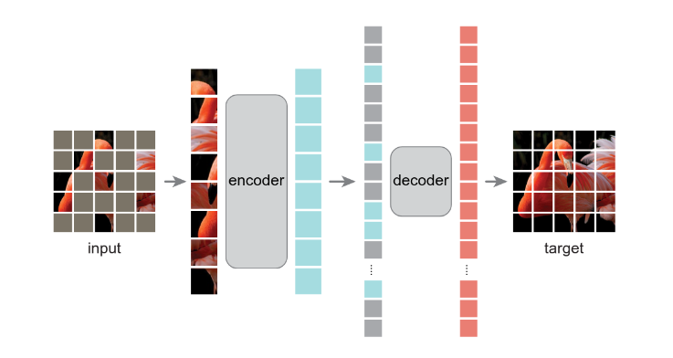
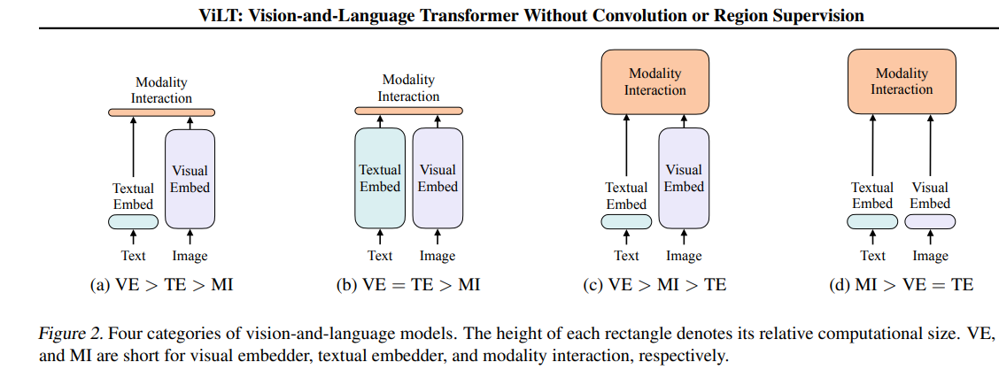
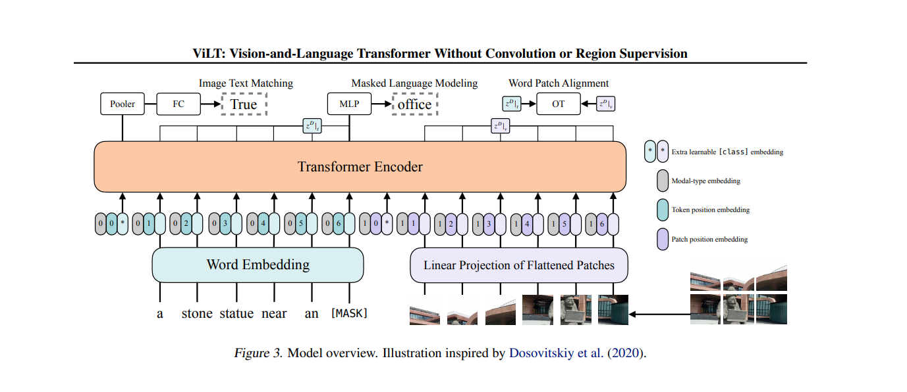
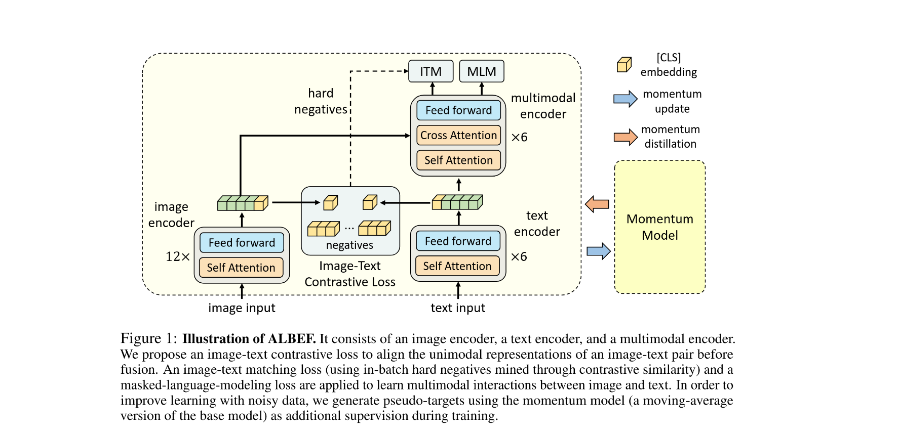

# Multimodals in 2021 - 2022
   1. MAE: Masked Autoencoders Are Scalable Vision Learners
   2. ViLT: ViLT: Vision-and-Language Transformer Without Convolution or Region Supervision
   3. CLIP: Learning Transferable Visual Models From Natural Language Supervision
   4. ALBEF: Align Before Fuse: Vision and Language Representation Learning with Momentum Distillation
   5. VLMO: VLMO: Unified Vision-Language Pre-Training with  Mixture-of-Modality-Experts
   6. BLIP: Bootstrapping Language-Image Pre-training for Unified Vision-Language Understanding and Generation
   7. CoCa: CoCa: Contrastive Captioners are Image-Text  Foundation Models
   8. BEiTv3: Image as a Foreign Language: BEIT Pretraining for  All Vision and Vision-Language Tasks

## MAE:
According to the article of the paper shows that autoencoders are used to learn representations of data.(x and y are the same image).

```
1. in language bert is used. but why vision cannot be masked?
2. vit has emerged and can be used(patches), previous CNN-based model cannot use this. although convolutional networks includes postion information it self, however, their calculation are sync with the window and cannot use the **global information**, therefore hard to reconstruct.

3. information density: different between language and vision, language is more dense. images are heavy spatial redundancy. 
```

**encoder(vit)** is used to learn the representation of the input image, and **decoder(transformer block)** is used to reconstruct the original image from the learned representation. The loss function is usually mean squared error between the original image and the reconstructed image.

## ViLT
### Note this figure is important.

This image illustrates the different architectures of early multimodal models. The left part shows the **two-stream architecture**,

 CLIP is the second type, ViLT is the last type.
 
 1. ViLT want to reduce the burden of visual encoder
 2. MI(modality-interaction) is the key to multimodal learning, and the cross-modal encoder is the most common way to achieve this.
 3. based ViT, use only patch split.
 4. **Word Patch Alignment Loss**, WPA Loss: align the patch and word, which is a kind of contrastive loss, but only for the patch and word, not for the whole image and text. <font color = red>hard to train, use ITC to replace it.</font>

result is not so good.

## CLIP
is good for Image-Text Retrieval, but not good for VQA, which is a more complex task. 
1. Modality interaction is only a simple dot product, which is fast and efficient, but not powerful enough to capture the complex relationships between images and text.
2. CLIP is trained with a contrastive loss, which is not suitable for VQA.
$$\mathcal{L} = -\log \frac{e^{\frac{f_i^T g_j}{\tau}}}{\sum_{k=1}^{N} e^{\frac{f_i^T g_k}{\tau}}}$$
## ALBEF
1. vision encoder should be big.
2. multimodal should be big.
3. language model do not need to be big.
4. if used pretrained vision encoder, **not aligned** with the language model. so align them with a contrastive loss.
5. <font color = red>**noisy web data**</font>(do not describe the image well): Momentum distillation(pseudo label)


just cut the language model into two parts, while maintaining the same number of parameters, introduce a larger cross-modal encoder to fuse the image and text features.
```
ITC for Vision Retrieval.
ITM for VQA.
MLM for language modeling.
```