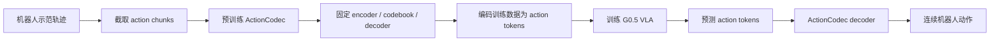

**ActionCodec**: 常先独立预训练，再冻结或基本固定，用来把机器人动作编码成 token、再解码回连续动作。
训练流程可以分成两阶段：

### 1. 先训练 ActionCodec

给定动作片段

$$
A_t=[a_t,\ldots,a_{t+H-1}],
$$

ActionCodec 学习：

$$
A_t
\rightarrow
C_t
\rightarrow
\hat A_t,
$$

其中 $C_t$ 是离散 token，$\hat A_t$ 是重建动作。这个阶段主要优化：

- 动作重建误差；
- 离散 codebook 的学习；
- 相邻动作 chunk 的 token 稳定性；
- 动作 token 与语言、视觉上下文的对应关系；
- 跨机器人 embodiment 的共享表示。

ActionCodec 原论文明确把它定义为一个先将动作编码到 latent、再通过 codebook 量化、最后重建动作的 VQ tokenizer。[VQ Tokenizer](https://www.alphaxiv.org/abs/2602.15397?page=3)

但需要注意：它不是只追求 $\hat A_t$ 和 $A_t$ 的重建误差。论文认为，适合 VLA 的 tokenizer 还必须生成稳定、紧凑、容易从视觉语言输入预测的 token。[Tokenizer Design](https://www.alphaxiv.org/abs/2602.15397?page=2)

### 2. 再用它生成 VLA 的监督标签

ActionCodec 训练好之后，用 encoder 将示范动作转换为 token：

$$
A_t \xrightarrow{\text{ActionCodec encoder}} C_t.
$$

VLA 的训练目标变成：

$$
p_\theta(C_t\mid o_t,\ell,s_t,e),
$$

也就是根据图像、指令、本体状态和机器人类型预测离散动作 token，而不是直接回归连续动作。

G0.5 的设计描述了这一流程：模型生成离散 action codes，然后这些 codes 由跨 embodiment 的 ActionCodec 解码成连续控制命令。[Action Decoding](https://www.alphaxiv.org/abs/2608.11739?page=6)

### 3. G0.5 中的 ActionCodec 是否完全固定？

这里要区分两个阶段。

**普通 VQ 版本：**  
ActionCodec 先训练好，然后用于产生 VLA 的 action-token 标签和推理时的动作解码。论文的整体描述把它当作一个预先学习的动作表示模块，而不是和 G0.5 的 VLM 一起端到端更新。

**RVQ post-training 版本：**  
论文还采用了一个额外的 RVQ refinement 阶段：

1. 先训练一个单层 VQ ActionCodec，重点保证 token 稳定性和视觉语言对齐；
2. 冻结 encoder 和第一套 codebook；
3. 再增加 residual codebooks，进一步降低动作重建误差；
4. 将改进后的 decoder 用于更精细的动作重建。

这样可以在不改变原始 action-token 序列的情况下提高连续动作的解码精度。[RVQ Post-training](https://www.alphaxiv.org/abs/2602.15397?page=6)

因此更准确地说：

> **ActionCodec 是先于 VLA 训练好的动作编解码器；G0.5 再使用它把示范动作转换为离散监督 token，并在推理时把预测 token 还原成连续动作。它不是 G0.5 每次训练时都和 VLM 一起从头学习的。**
